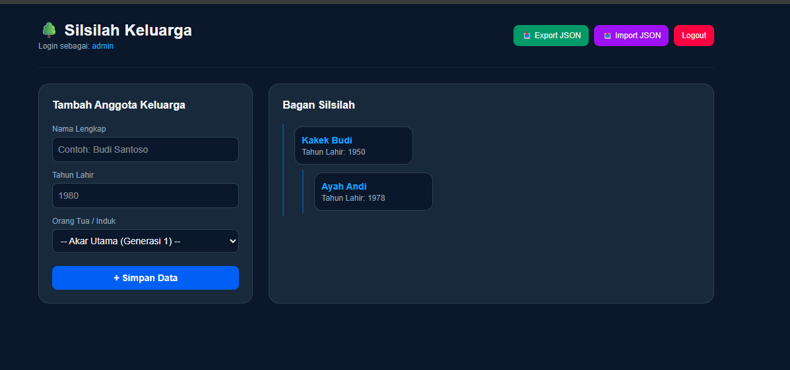
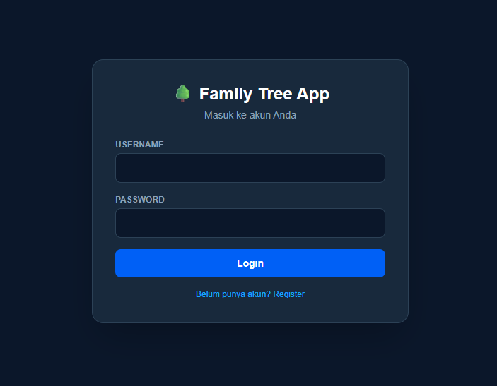

# 🌳 Silsilah Keluarga (Family Tree App)

Aplikasi berbasis web/mobile interaktif untuk mencatat, mengelola, dan memvisualisasikan silsilah keluarga (pohon genealogi) antar generasi secara mudah dan rapi.

---

## 📸 Tampilan Aplikasi (Screenshots)

> *Tambahkan gambar atau GIF pratinjau aplikasi di sini.*

| Halaman Utama / Pohon Keluarga | Form Login |
| :---: | :---: |
|  |  |

---

## ✨ Fitur Utama

- 🌲 **Visualisasi Interaktif:** Menampilkan pohon keluarga dengan hirarki yang jelas dan dapat di-zoom/pan.
- 👤 **Manajemen Profil Anggota:**
  - Data diri (Nama lengkap, panggilan, tanggal lahir/wafat, foto).
  - Hubungan keluarga (Orang tua, pasangan, anak, saudara).
- 🔐 **Login & Register:** Terdapat fitur login dan register untuk mengakses aplikasi.
- 💾 **Import & Export:** Terdapat fitur import dan export data untuk menyimpan dan memuat data silsilah keluarga.

---

## 🛠️ Teknologi yang Digunakan

- **Frontend:** [Next.js]
- **Backend:** [Node.js]
- **Library Diagram/Pohon:** [D3.js]

---

## 🚀 Cara Menjalankan Project (Installation)

Prasyarat yang dibutuhkan:
* [Node.js](https://nodejs.org/) (v22+) 
* [Git](https://git-scm.com/)

## 🔑 Akses Login Demo / Akun Default

> **Catatan:** Gunakan kredensial di bawah ini untuk menguji aplikasi pada mode lokal/demo.

| Role / Akses | Username | Password |
| :--- | :--- | :--- |
| **Admin** | `admin` | `123` |

